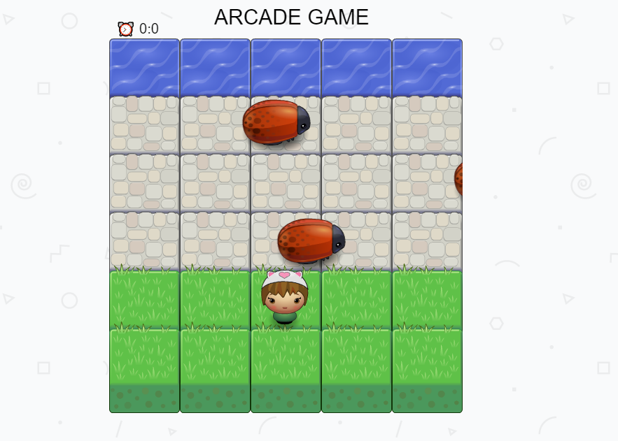
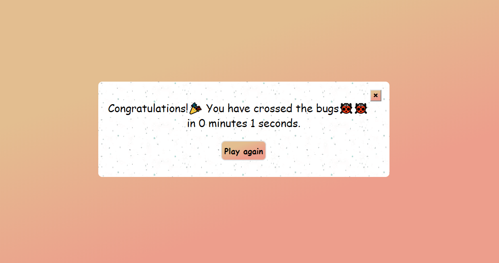
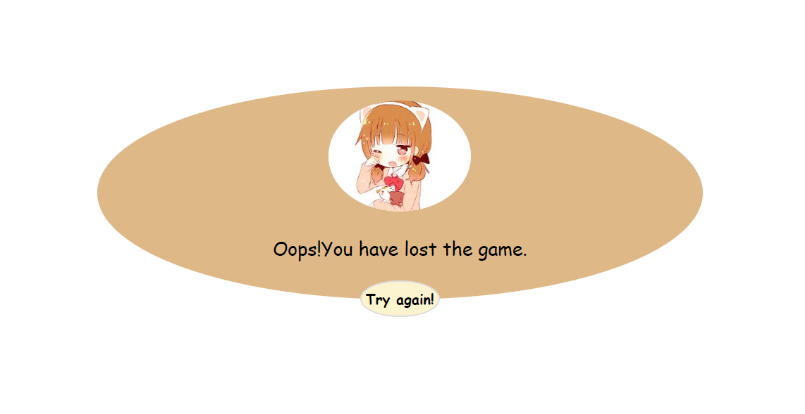

# Classic Arcade Game Clone Project

## Table of Contents

- [Scratch Project's Link](#Scratch-Projects-Link)
- [Folders and files used in this project](#Folders-and-files-used-in-this-project)
- [Game Criteria](#Game-Criteria)
- [How to load the game?](#How-to-load-the-game)
- [How to play?](#How-to-play)
- [Views of windows used in this game](#Views-of-windows-used-in-this-game)
- [Steps followed in building this project](#Steps-that-I-have-followed-in-building-this-project)
- [Contributing](#Contributing)

## Scratch Project's Link

This project's scratch can be downloaded from the following links:

- <https://github.com/udacity/frontend-nanodegree-arcade-game>

- <https://github.com/udacity/frontend-nanodegree-arcade-game.git>

--------------------------------------------------------------------------------

## Folders and files used in this project:

The folders used in this project are **css, images ,js, sounds**. The files used in this project are **style.css,app.js,engine.js,resources.js,index.html and README.md**.

==>css: This folder consists of style.css file which have all the styles for components used in the game.

==>js: This folder consist of app.js,engine.js and resources.js which consists of java script code required for building the game.

==>images: This folder consist of all the images required for the game.(with extensions, ".jpg" and ".png").

==>sounds:This folder consist of all the sounds required for the game.(with ".mp3" extension).

==>index.html: This file consists of HTML code which plays main role in getting the view of game window.

--------------------------------------------------------------------------------

## Game Criteria

- In this game, a `Player` sprite and enemy sprites(bugs) are considered.
- Grass area, stone area and water area is considered in a canvas.
- Initially, `Player` will be in grass area.
- `Player` has to reach the water area by crossing the bugs without collision which randomly move on stone area.
- A timer will be started when the game is loaded.
- If `Player` collide a bug, a pop-up window is displayed which consist "Try Again" button.
- If the `Player` reaches water area(destiny) with out colliding bugs, then a pop-up window is displayed which provides time taken and a "Play Again" button.

--------------------------------------------------------------------------------

## How to load the game?

```
After downloading the scratch project, unzip the folder and open "index.html" in a web browser. Initially, there will be some errors. So, debug the game, that is, remove the errors by changing the code where it is required, in order to have a look at the static version of game.
```

--------------------------------------------------------------------------------

## How to play?

1.The player has to move the sprite in order to cross the bugs and reach destiny using "arrow keys".  
- **Right Arrow** is for moving the sprite in the right direction.
- **Left Arrow** is for moving the sprite in the left direction.
- **Up Arrow** is for moving the sprite in the forward direction.
- **Down Arrow** is for moving the sprite in the backward direction.
2.If player has lost the game and wants to try it again, then he/she has to press the "Try Again" button.
3.If player has won the game and wants to play again, he/she has to press the "play again" button.

--------------------------------------------------------------------------------

## Views of windows used in this game

_The view of game window:_



_The view of window that will be displayed when player wins the game:_



_The view of window that will be displayed when player lose the game:_



## Steps followed in building this project

1.First,I have downloaded the scratch project into my work station and unzipped the folder.

2.Then opened "index.html" file in a web browser. I found some errors, so I have debugged the game by modifying the code. Then, I have got the static version of game.

3.Then,I have created required `Player` and `Enemy` objects.

4.Then,I have rendered the `Player` and `Enemies` on the screen using **prototype.render** function.

5.`Player` position is initially fixed by passing the coordinate values to the constructor while creating the object.

6.Then,I have defined **Enemy.prototype.update** function for updating the positions of enemies.

7.Next,I have defined **Player.prototype.handleInput** which handles, in which direction and how much distance the player has to move when a specific key is pressed using "switch case".

8.Then, an event listener is added to listen for key presses and send the keys to "Player.handleInput()" method.

9.I have provided speeds for enemies(bugs) using **Math.random** function.

10.Then, I have added sounds to game by created objects to "Audio" class in order to make game effective.

11.I have added timer, which starts on player's first arrow key's stroke after loading a new game.

12.Then,a HTML division is designed using css which is made to display when `Player` collide a bug. This division consists of "Try Again" button.

13.Next,another HTML division is designed using CSS whick is made to display when `Player` cross the bugs without collision with bugs.This division consists of time taken, "Play again" button and a "close" button.

14.Timer is handled in **time()** function.

--------------------------------------------------------------------------------

## Contributing

This zip folder consists of all the folders and files that consist required code and components to build an **Arcade Game**.This project folder is for the one who wants to take a look and know how to build a classic arcade game using object-oriented java script.
